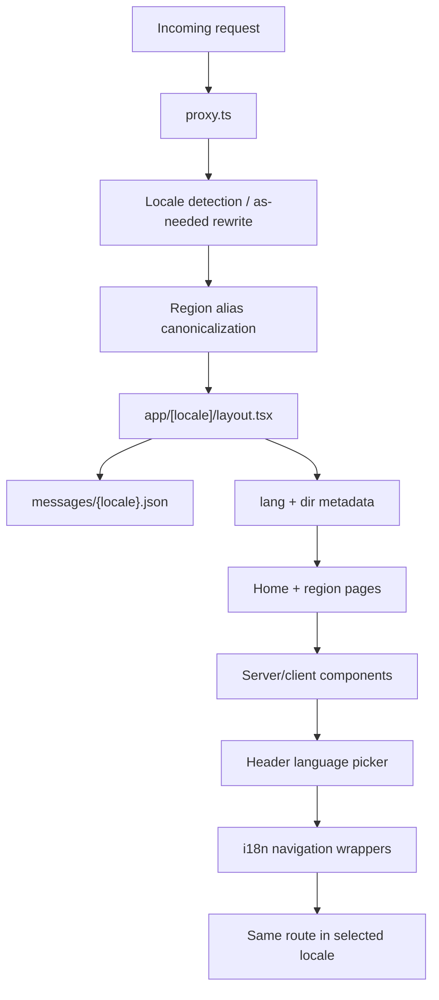

# feat: Internationalize and localize site

## Overview

Internationalize the Next.js App Router site so all user-facing copy, metadata, structured data, navigation URLs, and interactive status labels can be translated. Keep English on the existing base routes, add locale-prefixed routes for non-English languages, and add a language picker in the top-right header that lets visitors switch the current page into another supported language.

The recommended implementation uses `next-intl` with a single top-level `[locale]` route tree and an as-needed locale prefix strategy. Public English URLs remain unprefixed, but internally they should be handled by the same locale route tree via proxy/middleware rewrites. This avoids adding a sibling `app/[id]` dynamic route that would collide with `app/[locale]`.

## Problem Frame

The current site is English-only. Copy is embedded across `app/page.tsx`, `app/[id]/page.tsx`, `components/*`, `lib/site.ts`, and `lib/regions.ts`. Region aliases are normalized by `proxy.ts`, SEO metadata assumes `en_US`, sitemap entries are unlocalized, and `SiteHeader` has only the logo link.

The new architecture needs to separate stable data from translated presentation strings, preserve existing English routes, add prefixed non-English routes through rewrites/navigation, and avoid turning the language picker into a cosmetic toggle that leaves metadata, `lang`, URLs, and SEO in English. It must also avoid a dynamic-route collision between region slugs and locale codes.

## Requirements Trace

- R1. Extract all visible site copy into translation messages, including headings, labels, aria labels, button titles, empty/loading/error states, share text, footer links, and generated Open Graph image text.
- R2. Localize metadata and structured data: titles, descriptions, Open Graph/Twitter metadata, JSON-LD page names/descriptions, breadcrumb labels, and `html lang`.
- R3. Support base English routes plus locale-prefixed non-English App Router routes for the home and region pages, with static generation where feasible.
- R4. Preserve current region slugs and aliases, including canonical redirects for region aliases inside and outside locale-prefixed routes.
- R5. Add a language picker in the header top right that switches the current route to the selected locale without losing the current region page.
- R6. Keep region IDs, JSONBin region codes, team IDs, share slugs, country view data, and QR targets stable across locales.
- R7. Update sitemap and alternates so base English pages and localized non-English pages are discoverable by search engines.
- R8. Keep tests meaningful around routing, translations, metadata, and the language picker.
- R9. Treat Arabic and Urdu as first-class RTL locales: set document direction correctly, audit physical left/right layout assumptions, and verify responsive UI in both LTR and RTL.
- R10. Avoid ambiguous one-segment dynamic route collisions between locale codes and region IDs/aliases.
- R11. Localize country names in country-view displays by resolving JSONBin country names to country codes and formatting display names per locale where possible.

## Scope Boundaries

- This plan starts with English plus the top twelve global languages by total speakers, using English as the unprefixed default. All twelve locales should be implemented, routable, and structurally complete before handoff; initial non-English copy can be replaced by approved human translations, but the locale files and routes must not be partially enabled.
- This plan does not localize external Journey language names returned by the NextSteps data source; those names should continue to show the language’s English/native names from the feed.
- This plan does not localize the external legal pages linked in the footer unless translated URLs are supplied later.
- This plan does not change QR destination URLs, Journey slugs, JSONBin fetching, or country view aggregation. It may add normalization around JSONBin country-name rows so country names can be displayed in the active locale.

### Deferred to Separate Tasks

- Translation management workflow: decide whether messages stay in repo JSON files or move into a TMS such as Crowdin after the first localization pass.
- Locale-specific imagery: current images can remain shared unless brand/content review requests localized image text.

## Context & Research

### Relevant Code and Patterns

- `app/layout.tsx` owns fonts, global metadata, JSON-LD organization/site schema, and hard-coded `<html lang="en">`. Because only the root layout can render `<html>` and `<body>`, the implementation should move this root layout responsibility under `app/[locale]/layout.tsx` rather than create a nested child layout that tries to set `html lang`.
- `app/page.tsx` composes the home page and creates home JSON-LD from `lib/site.ts`.
- `app/[id]/page.tsx` generates static region pages today, but it must not remain as a sibling of `app/[locale]` because `app/[id]` and `app/[locale]` are both one-segment dynamic routes. Region pages should move to `app/[locale]/[id]/page.tsx`.
- `proxy.ts` currently canonicalizes unlocalized region aliases like `/Africa` to `/africa`.
- `lib/regions.ts` mixes stable routing/data identifiers with localized names, blurbs, SEO descriptions, and flag labels.
- `lib/country-views.ts` currently accepts JSONBin country names and only trusts `prod_geo[iso3_2]` when present. Some rows may need deterministic country-name-to-code normalization before localized display names can be produced.
- `components/site-header.tsx` is the natural home for the top-right language picker.
- `components/home-step-cards.tsx` and `components/region-step-cards.tsx` duplicate the same translatable step copy.
- `components/region-share-panel.tsx` contains many client-side labels, status titles, share text, error strings, and generated filenames.
- The current UI already uses flexbox/grid heavily, which helps RTL adaptation, but several hotspots still use physical direction utilities or coordinates: `right-5`, `pr-*`, `mr-*`, `text-left`, `origin-left`, absolute dropdown positioning, region-card arrow placement, auto-advance progress origin, and iframe preview transform origin.
- Existing tests already cover proxy behavior, region data, country views, lazy map loading, and share panel behavior.

### Institutional Learnings

- No existing `docs/solutions/` files were present for i18n or localization patterns.

### External References

- Next.js App Router i18n guide: recommends locale subpaths or domains, proxy-based locale redirects, nesting special files under `app/[lang]`, and loading dictionaries by locale.
- `next-intl` App Router docs: provide request-scoped messages, `NextIntlClientProvider`, `getTranslations`, and App Router support.
- `next-intl` locale routing docs: recommend `i18n/routing.ts`, `i18n/navigation.ts`, proxy integration, `[locale]` layout, `generateStaticParams`, `setRequestLocale`, and forwarding locale into metadata.
- `next-intl` metadata/sitemap docs: recommend `getTranslations({locale})` for metadata and localized sitemap alternates when needed.
- Berlitz/Ethnologue-based 2026 total-speaker ranking: English, Mandarin, Hindi, Spanish, French, Arabic, Portuguese, Bengali, Russian, Urdu, Indonesian, and German are the first twelve listed languages by total speakers.

## Key Technical Decisions

- Use as-needed locale-prefixed routing, e.g. `/`, `/africa`, `/es`, `/es/africa`: This preserves current English URLs while giving every non-English locale persistent URLs and keeping metadata, `html lang`, and canonical/alternate links aligned.
- Use `next-intl` rather than a hand-rolled context: The app has both server and client components, metadata generation, sitemap needs, and route-aware navigation. `next-intl` covers these with App Router-native APIs.
- Keep English unprefixed as the default locale: `/` and `/:region` remain canonical English URLs; non-English routes use locale prefixes such as `/es` and `/es/:region`.
- Use one internal dynamic route tree: `app/[locale]/page.tsx` and `app/[locale]/[id]/page.tsx` are the only dynamic page routes after migration. Do not keep `app/[id]/page.tsx`; unprefixed English URLs should be rewritten internally to the default locale route rather than implemented as a second dynamic page.
- Centralize locale definitions in `i18n/routing.ts`: Locale labels for the picker, default locale, and supported locales should be configured in one place.
- Split stable region config from localized region messages: IDs, JSONBin codes, team IDs, display codes, and flag country codes remain in TypeScript; region names, blurbs, SEO descriptions, and flag labels move to messages.
- Prefer translation keys over prop-drilling strings when a component is clearly locale-owned: Server components can use `getTranslations`; client components can use `useTranslations` through `NextIntlClientProvider`.
- Localize country display names by country code: prefer the JSONBin `iso3_2` value when valid; when it is missing, attempt deterministic name-to-code normalization for known JSONBin country names; then use locale-aware display formatting for visible country names with the JSONBin name as fallback.
- Preserve existing data formatting helpers initially, then localize number formatting where visible: `formatViews` can remain stable for the first pass, but count/number labels should move to ICU messages so plurals are ready.
- Use document-level direction, not per-component hacks: derive `dir` from locale metadata and set it on the locale layout so CSS logical properties and browser bidi handling can do most of the work.
- Prefer logical Tailwind utilities/CSS over physical left/right utilities when editing shared layout: use start/end concepts for padding, margins, text alignment, positioning, and transform origins where supported; keep physical coordinates only when the visual should intentionally remain physical.

## Initial Locale Set

Use these twelve locales for the first localization pass, ordered by total speakers. Locale codes are the implementation target unless product review chooses a more specific regional variant.

| Rank | Language            | Locale    | Notes                                                                                             |
| ---- | ------------------- | --------- | ------------------------------------------------------------------------------------------------- |
| 1    | English             | `en`      | Default locale; canonical routes remain unprefixed.                                               |
| 2    | Mandarin Chinese    | `zh-Hans` | Use Simplified Chinese for the first pass.                                                        |
| 3    | Hindi               | `hi`      | Devanagari script.                                                                                |
| 4    | Spanish             | `es`      | Neutral/global Spanish unless a regional variant is requested.                                    |
| 5    | French              | `fr`      | Neutral/global French.                                                                            |
| 6    | Arabic              | `ar`      | Right-to-left; use Modern Standard Arabic for UI copy.                                            |
| 7    | Portuguese (Brazil) | `pt-BR`   | Use Brazilian Portuguese now to avoid later URL churn if European Portuguese is added separately. |
| 8    | Bengali             | `bn`      | Bengali script.                                                                                   |
| 9    | Russian             | `ru`      | Cyrillic script.                                                                                  |
| 10   | Urdu                | `ur`      | Right-to-left; Perso-Arabic script.                                                               |
| 11   | Indonesian          | `id`      | Also commonly referred to as Bahasa Indonesia.                                                    |
| 12   | German              | `de`      | Neutral German.                                                                                   |

## Open Questions

### Resolved During Planning

- Route shape: Use unprefixed English routes and prefixed non-English routes, because the current base URLs already work while non-English pages still need distinct localized URLs.
- Dynamic route collision: Do not keep `app/[id]` beside `app/[locale]`. Use middleware/proxy routing so public `/africa` maps to the internal default-locale region route and public `/es/africa` maps to the internal Spanish region route.
- Header placement: Add the picker inside `SiteHeader` aligned to the top right while preserving the logo home link.
- Region slugs: Keep canonical region slugs stable across locales for this pass; localizing pathnames can be a future SEO enhancement.

### Deferred to Implementation

- Exact regional variants for `zh-Hans`, `es`, and `fr`: Start with neutral/global locale codes where possible, but product/localization review may choose regional variants before final translation.
- Whether to mirror decorative/icon-only motion in RTL: default to mirroring navigational direction icons and start/end-aligned UI affordances, but keep neutral decorative motion unchanged unless it reads as directional navigation.
- Translation copy quality: Placeholder or machine draft strings are acceptable for plumbing tests, but production copy should be reviewed by fluent speakers.
- Exact localized legal URLs: Continue linking to current URLs unless localized Jesus Film Project legal pages are provided.

## High-Level Technical Design

> _This illustrates the intended approach and is directional guidance for review, not implementation specification. The implementing agent should treat it as context, not code to reproduce._

## Implementation Units

- [x] **Unit 1: Add i18n foundation and locale routes**

**Goal:** Install and configure the i18n infrastructure, move the route tree under `[locale]`, and keep the app statically renderable where practical.

**Requirements:** R2, R3, R7

**Dependencies:** None

**Files:**

- Modify: `package.json`
- Modify: `pnpm-lock.yaml`
- Modify: `next.config.ts`
- Move/modify: `app/layout.tsx` to `app/[locale]/layout.tsx`
- Move/modify: `app/page.tsx` to `app/[locale]/page.tsx`
- Move/modify: `app/[id]/page.tsx` to `app/[locale]/[id]/page.tsx`
- Create: `i18n/routing.ts`
- Create: `i18n/navigation.ts`
- Create: `i18n/request.ts`
- Create: `messages/en.json`
- Create: `messages/zh-Hans.json`
- Create: `messages/hi.json`
- Create: `messages/es.json`
- Create: `messages/fr.json`
- Create: `messages/ar.json`
- Create: `messages/pt-BR.json`
- Create: `messages/bn.json`
- Create: `messages/ru.json`
- Create: `messages/ur.json`
- Create: `messages/id.json`
- Create: `messages/de.json`
- Test: `test/i18n-routing.test.ts`
- Test: `test/messages.test.ts`

**Approach:**

- Add `next-intl` using `pnpm`.
- Wrap the current `nextConfig` with the `next-intl` plugin while preserving `output: "standalone"` and `reactStrictMode`.
- Configure routing so `en` is the default locale and only non-default locales receive URL prefixes.
- Remove the sibling `app/[id]/page.tsx` route after moving it under `app/[locale]/[id]/page.tsx`; otherwise `app/[id]` and `app/[locale]` collide at the same path depth.
- Move the root layout responsibility to `app/[locale]/layout.tsx` so that locale validation, `html lang`, `dir`, fonts, `NextIntlClientProvider`, and shared schema live in the same layout that renders `<html>` and `<body>`.
- Add locale metadata that identifies direction, with `ar` and `ur` returning `rtl` and every other initial locale returning `ltr`.
- Do not keep a second parent layout with its own `<html>` wrapper; that would prevent the locale layout from owning `html lang`.
- Add `generateStaticParams` for all supported locales at the locale layout level.
- Call the locale static-rendering helper before using translation APIs in locale pages/layouts.
- Seed `messages/en.json` with namespaces that mirror the app shape, for example `Metadata`, `Home`, `Region`, `Steps`, `CountryViews`, `SharePanel`, `Footer`, and `LanguagePicker`.
- Create structurally complete message files for all eleven non-English locales before enabling those locales in routing/static params. Draft copy is acceptable for implementation, but missing files or missing keys are not.
- Add a message parity test that recursively compares every locale file against `messages/en.json` and fails with readable missing/extra key paths.

**Patterns to follow:**

- Current font/global styling setup in `app/layout.tsx`.
- Current static params pattern in `app/[id]/page.tsx`.
- Next.js and `next-intl` App Router i18n setup guidance.

**Test scenarios:**

- Happy path: supported locales generate static params for the locale layout, with English resolving at unprefixed routes and non-English locales resolving at prefixed routes.
- Happy path: the default locale loads English messages and renders the home page without missing-message errors.
- Happy path: `ar` and `ur` pages render with `dir="rtl"` while `en`, `es`, and other LTR pages render with `dir="ltr"`.
- Happy path: every configured locale has a message file with the same key structure as English before it appears in `routing.locales`.
- Edge case: no sibling dynamic route remains at `app/[id]`; route inventory has no same-depth dynamic collision between `[id]` and `[locale]`.
- Edge case: unsupported locale returns not found instead of rendering fallback copy silently.
- Error path: adding a locale to routing without a corresponding complete message file fails tests before build handoff.

**Verification:**

- Localized home and region route files exist under `app/[locale]`.
- Existing source pages are no longer reachable as duplicate unlocalized render targets.
- `app/[id]/page.tsx` no longer exists after migration; public `/africa` still works through the as-needed locale routing layer.
- English render output is visually equivalent and remains reachable at the existing unprefixed URLs.
- RTL locales set document direction from the root locale layout, not ad hoc component wrappers.
- All configured locales have complete message files and pass message parity tests.

- [x] **Unit 2: Localize stable site, metadata, and region content**

**Goal:** Move site metadata and region presentation copy into translations while preserving stable region/data identifiers.

**Requirements:** R1, R2, R6, R7

**Dependencies:** Unit 1

**Files:**

- Modify: `lib/site.ts`
- Modify: `lib/regions.ts`
- Create: `lib/localized-regions.ts`
- Modify: `app/[locale]/page.tsx`
- Modify: `app/[locale]/[id]/page.tsx`
- Move/modify: `app/opengraph-image.tsx` to `app/[locale]/opengraph-image.tsx`
- Move/modify: `app/twitter-image.tsx` to `app/[locale]/twitter-image.tsx`
- Modify: `app/sitemap.ts`
- Test: `test/regions.test.ts`
- Test: `test/localized-regions.test.ts`
- Test: `test/sitemap.test.ts`

**Approach:**

- Keep `REGIONS` or a renamed base config as stable data: `id`, `code`, `displayCode`, `teamId`, and flag country codes.
- Add a locale-aware helper that combines base region config with translated `name`, `blurb`, `seoDescription`, and flag labels.
- Generate home and region metadata with locale-scoped translation lookups.
- Update Open Graph/Twitter image generation under the locale segment so image alt/text can use locale-scoped translations. If a root-level fallback image route is retained for crawlers or old links, keep it default-locale only and document that it is not the canonical localized image route.
- Generate sitemap entries for each locale and region, including alternate language URLs.
- Generate page-level metadata alternates as well as sitemap alternates: unprefixed English pages should canonicalize to unprefixed URLs, and non-English pages should canonicalize to their prefixed URLs.
- Set Open Graph locale values from locale metadata rather than hard-coded `en_US`.

**Patterns to follow:**

- Existing `lib/site.ts` constants as the source of stable site URL/image values.
- Existing `generateMetadata` logic in `app/[id]/page.tsx`.
- Current sitemap shape in `app/sitemap.ts`.

**Test scenarios:**

- Happy path: `getLocalizedRegion("en", "africa")` returns stable IDs/codes plus English display copy.
- Edge case: missing or unsupported region still returns `undefined` and region page uses `notFound`.
- Integration: sitemap contains unprefixed English home/region pages plus prefixed home/region pages for every non-default locale.
- Integration: sitemap alternates include every supported locale for a given route.
- Integration: page metadata for `/africa` and `/es/africa` includes correct canonical and alternate language URLs.
- Regression: JSONBin region codes and team IDs are unchanged after localization.

**Verification:**

- No SEO title/description strings remain hard-coded in pages except stable brand/product names.
- Region tests prove stable identifiers did not drift.

- [x] **Unit 3: Localize country view display names**

**Goal:** Convert JSONBin country names into stable country codes where possible, then render localized country display names in the map/list UI.

**Requirements:** R1, R6, R8, R11

**Dependencies:** Units 1 and 2

**Files:**

- Modify: `lib/country-views.ts`
- Modify: `lib/map-utils.ts`
- Modify: `components/country-views-summary.tsx`
- Modify: `components/home-country-views-interactive.tsx`
- Create: `lib/country-display.ts`
- Test: `test/country-views.test.ts`
- Test: `test/country-display.test.ts`
- Test: `test/home-country-views-interactive.test.tsx`

**Approach:**

- Preserve existing JSONBin fetching and aggregation, but strengthen normalization so each `CountryView` carries the best available country code.
- Prefer a valid JSONBin `prod_geo[iso3_2]` value when present. If missing, normalize the JSONBin country name and look it up in a deterministic alias table built from the current JSONBin country-name set plus known exceptional names such as Kosovo.
- Keep the original source country name as a fallback for rows that cannot be mapped confidently.
- Render visible country names through a locale-aware helper. Use `Intl.DisplayNames` with the active locale and country code where possible; fall back to English/source names when the runtime cannot format a code.
- Keep technical country codes and map support behavior stable; do not change country-view filtering by region.

**Patterns to follow:**

- Existing normalization functions in `lib/country-views.ts`.
- Existing `formatViews`/map-data helper style in `lib/map-utils.ts`.

**Test scenarios:**

- Happy path: a row with a valid JSONBin country code displays a localized country name for `es`, `fr`, and `pt-BR`.
- Happy path: a row missing `iso3_2` but matching a known JSONBin country-name alias receives the expected country code.
- Edge case: an unmapped source country name keeps the source name rather than being dropped or guessed incorrectly.
- Edge case: Kosovo and other real-list exceptions remain included according to current behavior.
- Regression: country-view sorting, region filtering, and map data values remain unchanged after adding localized display names.

**Verification:**

- Country view lists and map tooltips use localized display names when a code is available.
- The original JSONBin country name remains available for fallback/debugging.

- [x] **Unit 4: Extract component copy into translations**

**Goal:** Replace embedded visible text and accessibility text across components with translation keys.

**Requirements:** R1, R5, R6

**Dependencies:** Units 1 through 3

**Files:**

- Modify: `components/home-hero.tsx`
- Modify: `components/home-step-cards.tsx`
- Modify: `components/region-step-cards.tsx`
- Modify: `components/home-region-heading.tsx`
- Modify: `components/region-card.tsx`
- Modify: `components/region-hero.tsx`
- Modify: `components/region-share-heading.tsx`
- Modify: `components/region-share-panel.tsx`
- Modify: `components/home-country-views-section.tsx`
- Modify: `components/home-country-views-reveal.tsx`
- Modify: `components/country-views-section.tsx`
- Modify: `components/country-views-summary.tsx`
- Modify: `components/home-country-views-interactive.tsx`
- Modify: `components/other-regions-nav.tsx`
- Modify: `components/back-crumb.tsx`
- Modify: `components/site-footer.tsx`
- Modify: `components/site-header.tsx`
- Test: `test/home-country-views-section.test.tsx`
- Test: `test/home-country-views-interactive.test.tsx`
- Test: `test/country-views-section-lazy.test.tsx`
- Test: `test/region-share-panel.test.tsx`
- Test: `test/localized-copy.test.tsx`

**Approach:**

- Use server translation APIs in server components and `useTranslations` in client components.
- Deduplicate duplicated step-card copy between home and region pages into one translation namespace.
- Use ICU messages for interpolated copy such as `Activate {regionName}`, `{regionName} country views`, no-data states, share titles, and count labels.
- Keep Journey-provided language names and native names as feed data, not translated UI copy.
- Replace hard-coded aria labels, button titles, iframe titles, loading labels, and status labels with translations.
- Use localized number formatting for visible totals where practical, while preserving compact UI constraints.
- Pass locale or localized display helpers into country-view components so country list headings, metric labels, tooltips, and country names all render in the active locale.

**Patterns to follow:**

- Existing prop-driven component boundaries, especially `StepCard`, `RegionHero`, and `CountryViewsSummary`.
- Existing accessibility labels in `RegionSharePanel` and `OtherRegionsNav`.

**Test scenarios:**

- Happy path: home hero, steps, region heading, footer, and country views render English from messages.
- Happy path: region share panel renders translated field labels, button titles, status labels, and fallback text.
- Edge case: no journeys state uses localized empty text.
- Edge case: unavailable/no country views states interpolate the localized region name.
- Regression: country names in country-view summaries, rankings, and tooltips use localized display names where country codes are known.
- Regression: Journey language names remain the values supplied by the Journey data.
- Regression: locale-aware navigation links in `RegionCard`, `BackCrumb`, `OtherRegionsNav`, footer/home links, and the header logo keep users in the active locale instead of dropping them to English.

**Verification:**

- A targeted search for hard-coded English phrases in `app`, `components`, and `lib` has only intentional stable names, external brand names, or test fixtures remaining.

- [x] **Unit 5: Add RTL-aware layout support**

**Goal:** Ensure Arabic and Urdu render with correct directionality and that existing layout patterns adapt without broken alignment, clipped controls, or misleading directional icons.

**Requirements:** R2, R5, R8, R9

**Dependencies:** Units 1 through 4

**Files:**

- Modify: `app/[locale]/layout.tsx`
- Modify: `i18n/routing.ts`
- Modify: `app/globals.css`
- Modify: `components/site-header.tsx`
- Modify: `components/language-picker.tsx`
- Modify: `components/region-card.tsx`
- Modify: `components/region-hero.tsx`
- Modify: `components/region-share-panel.tsx`
- Modify: `components/home-country-views-interactive.tsx`
- Modify: `components/step-card.tsx`
- Test: `test/rtl-layout.test.tsx`
- Test: `test/language-picker.test.tsx`
- Test: `test/region-share-panel.test.tsx`

**Approach:**

- Set `dir` at the document level from centralized locale metadata; do not force RTL with component-local wrappers.
- Audit physical utilities found in current components and convert shared layout to logical start/end equivalents where the UI should mirror:
  - Region card arrow placement and right padding should become start/end aware.
  - Region hero metric spacing should avoid hard-coded `mr-*`.
  - Step card desktop text alignment should use a logical alignment strategy rather than always `text-left`.
  - Region share dropdown alignment and option text alignment should work in both LTR and RTL.
  - Country-view auto-advance progress should start from the inline start edge in both directions, or intentionally remain left-to-right only if documented.
- Keep data-heavy elements readable: URLs, QR values, slugs, country codes, and display codes can use `dir="ltr"` or unicode-bidi isolation inside RTL pages so technical strings do not reorder confusingly.
- Mirror icons only when they communicate navigation or direction. Decorative chevrons, QR/share/download icons, and neutral map controls should stay visually stable unless they imply reading direction.
- Use CSS logical properties or Tailwind logical utilities where available; otherwise add small `[dir="rtl"]` CSS selectors in `app/globals.css` for the few unavoidable physical cases.
- Verify with browser screenshots for at least `/ar`, `/ar/africa`, `/ur`, and `/ur/africa` at mobile and desktop widths.

**Patterns to follow:**

- Existing flexbox/grid layout should remain the default mechanism; only add RTL-specific CSS where flex/grid plus logical utilities are insufficient.
- Existing responsive constraints in `components/site-header.tsx`, `components/region-share-panel.tsx`, and `components/home-country-views-interactive.tsx`.

**Test scenarios:**

- Happy path: Arabic and Urdu pages set `dir="rtl"` on `<html>` and preserve `lang`.
- Happy path: language picker opens toward the inline end, remains within the viewport, and links from RTL pages back to unprefixed English correctly.
- Happy path: region share panel keeps Journey language names, share URLs, QR labels, and action buttons visually ordered and readable in RTL.
- Edge case: long Arabic/Urdu labels in the picker and share panel wrap or truncate without overlapping adjacent controls.
- Edge case: URL and slug strings remain left-to-right and selectable inside RTL pages.
- Visual regression: desktop and mobile screenshots for `/ar`, `/ar/africa`, `/ur`, and `/ur/africa` show no overlapping header, dropdown, region cards, metric rows, or share controls.

**Verification:**

- A search for physical left/right utilities in edited components has either been converted to logical equivalents or documented as intentionally physical.
- RTL and LTR screenshots are reviewed side by side before handoff.

- [x] **Unit 6: Combine locale routing with region alias proxy behavior**

**Goal:** Make as-needed locale routing and region alias canonicalization work together without duplicate routes, redirect loops, or locale/region ambiguity.

**Requirements:** R3, R4, R7, R10

**Dependencies:** Units 1 and 2

**Files:**

- Modify: `proxy.ts`
- Test: `test/proxy.test.ts`

**Approach:**

- Integrate `next-intl` proxy middleware with the existing region canonicalization behavior.
- Skip internal assets, static files, image routes, `robots.txt`, and `sitemap.xml`.
- For unprefixed English requests, preserve the existing canonical route shape publicly while routing internally through the default locale tree.
- For non-English requests, keep locale-prefixed route shape.
- For region aliases, canonicalize only the region segment while preserving any locale prefix and search params.
- Preserve existing canonical English slugs such as `/africa` and non-English slugs such as `/es/africa`.
- Classify the first path segment deterministically: if it is a supported non-default locale, treat it as locale; otherwise, attempt region alias matching for unprefixed English. This makes `/id` the Indonesian home route if enabled, not a region page.
- Use this decision table as the routing contract:

| Input                         | Outcome                                                                                     |
| ----------------------------- | ------------------------------------------------------------------------------------------- |
| `/`                           | Public English home; internally default locale.                                             |
| `/africa`                     | Public English Africa page; internally default locale region.                               |
| `/Africa?x=1`                 | Redirect to `/africa?x=1`.                                                                  |
| `/es`                         | Spanish home.                                                                               |
| `/es/Africa?x=1`              | Redirect to `/es/africa?x=1`.                                                               |
| `/id`                         | Indonesian home, not a region page.                                                         |
| `/en`                         | Redirect or resolve according to chosen `localePrefix` behavior without becoming canonical. |
| `/foo`                        | Not found unless it resolves to a valid region alias.                                       |
| `/_next/...` and static files | Bypass locale and region handling.                                                          |

**Patterns to follow:**

- Current `proxy.ts` normalization and 308 redirect behavior.
- Current `test/proxy.test.ts` request/redirect assertions.

**Test scenarios:**

- Happy path: `/` renders the default English home route without redirecting to `/en`.
- Happy path: `/africa` renders the default English region route without redirecting to `/en/africa`.
- Happy path: `/Africa?x=1` redirects to `/africa?x=1`.
- Happy path: `/{nonDefaultLocale}/Africa?x=1` redirects to `/{nonDefaultLocale}/africa?x=1`.
- Happy path: `/{nonDefaultLocale}/africa` passes through without redirect.
- Happy path: `/id` is interpreted as the Indonesian locale home route, not as a region `id`.
- Edge case: if a future region slug or alias equals a supported locale code, locale matching wins and the conflict is caught by a route-collision test before release.
- Edge case: `/en` redirects or resolves according to the selected `localePrefix` behavior without creating duplicate canonical English URLs.
- Edge case: unsupported locale does not get mistaken for a region alias.
- Edge case: static assets and special metadata routes are not internationalized or redirected.
- Regression: existing region alias inputs still canonicalize after locale prefixing.

**Verification:**

- Proxy tests cover unprefixed, locale-prefixed, alias, canonical, and skipped paths.

- [x] **Unit 7: Add header language picker**

**Goal:** Add a compact top-right picker that switches locales while staying on the current home or region route.

**Requirements:** R5, R8

**Dependencies:** Units 1 and 6

**Files:**

- Modify: `components/site-header.tsx`
- Create: `components/language-picker.tsx`
- Modify: `app/globals.css` only if shared responsive/focus styling is needed
- Test: `test/language-picker.test.tsx`

**Approach:**

- Align `SiteHeader` with logo on the left and picker on the right.
- Use the locale-aware navigation wrappers from `i18n/navigation.ts`.
- Show the current language label and a compact globe/language icon or chevron; use accessible text for screen readers.
- Build menu items from centralized locale config, not duplicated arrays.
- Preserve the current pathname when switching locales, including region pages.
- Use current design tokens: small radius, border, backdrop, focus-visible states, no nested cards.
- Keep the picker usable on mobile by avoiding long labels in the closed state and allowing full labels in the menu.
- Use logical alignment and document direction so the picker menu feels native in Arabic and Urdu while remaining top-right/top-end in the header design.

**Patterns to follow:**

- Existing custom dropdown interaction in `components/region-share-panel.tsx`, but scoped smaller for header use.
- Existing header logo link and responsive spacing in `components/site-header.tsx`.

**Test scenarios:**

- Happy path: picker renders all supported locale labels and marks the active locale.
- Happy path: selecting a non-English locale from `/africa` links to `/{selectedLocale}/africa`.
- Happy path: selecting English from `/{nonDefaultLocale}/africa` links back to `/africa`.
- Happy path: selecting a non-English locale from `/` links to the localized home route, e.g. `/es`.
- Edge case: menu closes after selection or outside click.
- Accessibility: closed button has a localized accessible label and each option has clear text.
- RTL: Arabic and Urdu picker states do not overlap the logo or fall off-screen on mobile.
- Regression: header logo, region cards, back crumb, and other-region links preserve the active locale when navigating.

**Verification:**

- The picker appears top right on desktop and mobile without pushing the logo out of view.
- Keyboard focus and screen-reader labels are present.

## System-Wide Impact

- **Interaction graph:** Requests pass through as-needed locale detection and region alias canonicalization before rendering locale-scoped layouts/pages. Header links, region cards, footer/home links, sitemap entries, and metadata must all use locale-aware URLs.
- **Error propagation:** Unsupported locales and unknown region IDs should end in `notFound`; missing translation keys should fail visibly in development/tests rather than silently falling back in production.
- **State lifecycle risks:** Client dropdown state in the language picker and share panel remains local UI state only. Locale switch navigation will remount pages under the new locale.
- **API surface parity:** Any route reachable by a user should be reachable by the language picker, sitemap, and tests using the same locale configuration.
- **Route collision safety:** There should be exactly one dynamic App Router page tree, `app/[locale]`; public unprefixed English region URLs are a routing concern, not a duplicate filesystem route.
- **Integration coverage:** Proxy tests and sitemap tests are the main cross-layer coverage; component tests catch translated rendering and picker link generation.
- **Directionality coverage:** Arabic and Urdu require document-level `dir="rtl"`, logical alignment checks, and screenshot review across home and region pages.
- **Country-name lifecycle:** Country views preserve source names for fallback, normalize known names to country codes, and render localized display names without changing view counts or region filtering.
- **Unchanged invariants:** Region IDs, display codes, JSONBin codes, team IDs, country view fetch behavior, Journey URLs, QR generation, and external legal URLs remain stable.

## Risks & Dependencies

| Risk                                                                                                     | Mitigation                                                                                                                                              |
| -------------------------------------------------------------------------------------------------------- | ------------------------------------------------------------------------------------------------------------------------------------------------------- |
| Route migration creates duplicate English URLs                                                           | Use as-needed locale prefixes and make unprefixed English routes canonical; test `/en` handling explicitly.                                             |
| Locale and region routes collide at one path segment                                                     | Remove `app/[id]` after moving region pages under `app/[locale]/[id]`; classify locale segments before region aliases in proxy tests.                   |
| Existing region alias proxy conflicts with i18n middleware                                               | Add explicit proxy tests for both unprefixed and locale-prefixed aliases before broad component work.                                                   |
| Translation extraction misses non-obvious text such as titles, aria labels, share text, or OG image copy | Add a final hard-coded English search and a `test/localized-copy.test.tsx` smoke test for major components.                                             |
| Country names remain English in localized views                                                          | Normalize JSONBin country names to codes and use locale-aware country display names with source-name fallback.                                          |
| Region data refactor breaks JSONBin filtering or Journey fetching                                        | Keep stable region data in TypeScript and add regression tests for codes/team IDs.                                                                      |
| Long translated labels break the compact design                                                          | Use responsive constraints, compact picker labels, and screenshot review after implementation.                                                          |
| RTL locales break header/share panel layout                                                              | Add a dedicated RTL layout unit, convert physical left/right assumptions to logical start/end where appropriate, and run Arabic/Urdu screenshot review. |
| Draft translations are mistaken for approved localization                                                | Track translation approval outside code review; keep non-English files structurally complete but clearly review-gated.                                  |

## Documentation / Operational Notes

- Update `README.md` with supported locales, how to add a new locale, and the required message-key validation test.
- Note in the deployment plan or release notes that English canonical routes stay unprefixed while non-English canonical routes are locale-prefixed.
- If analytics/search console are in use, monitor crawl/indexing after localized sitemap and redirects launch.

## Sources & References

- Next.js App Router internationalization guide: https://nextjs.org/docs/app/guides/internationalization
- `next-intl` App Router setup: https://next-intl.dev/docs/getting-started/app-router
- `next-intl` locale routing setup: https://next-intl.dev/docs/routing/setup
- `next-intl` navigation APIs: https://next-intl.dev/docs/routing/navigation
- `next-intl` metadata and sitemap guidance: https://next-intl.dev/docs/environments/actions-metadata-route-handlers
- Berlitz 2026 most spoken languages ranking: https://www.berlitz.com/blog/most-spoken-languages-world
- Related code: `app/layout.tsx`
- Related code: `app/page.tsx`
- Related code: `app/[id]/page.tsx`
- Related code: `proxy.ts`
- Related code: `lib/regions.ts`
- Related code: `lib/site.ts`
- Related code: `components/site-header.tsx`
